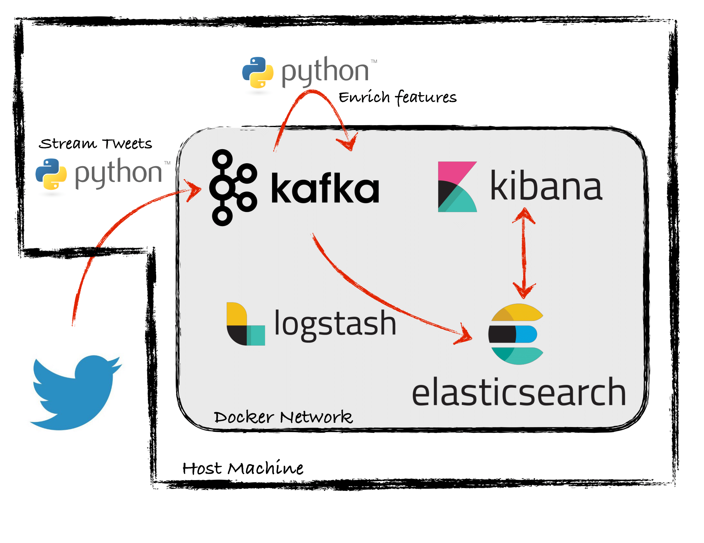

# TweetAnalyzer

TweetAnalyzer uses a containerized ELK stack, plus Kafka to serve as an intermediate buffer for holding raw and processed tweet data.

### Stream and Store Tweets in Real Time

Stream tweets based on keywords used, or the user accounts they are from. The tweets and their relevant information end up searchable in Kibana! 


### Use Dashboards in Kibana to Support Visualization


### Instructions for Use
- Create a developer account with Twitter [here](https://developer.twitter.com/en/apply-for-access).
- in the `python/` directory create a file called `secret.py`, and in it place
```python
api_key = "<YOUR API KEY>"
api_secret_key = "<YOUR API SECRET KEY>"
access_token = "<YOUR ACCESS TOKEN>"
access_token_secret = "YOU ACCESS TOKEN SECRET>"
```
- Make appropriate changes to the python streaming/nlp scripts, virtualenvs, and topic name in `logstash/pipeline.conf`.

### Notes
Running this stack led my machine to use about 6GB of memory. The offset retention seetting in kakfa is 1 minute, which helps keep memory consumption down, but the main culprit here is Elasticsearch. Be sure you have enough memory to spare before running.

### Dependencies
- Linux Host Machine
- Docker
- Python3
- Twitter (free) developer account
